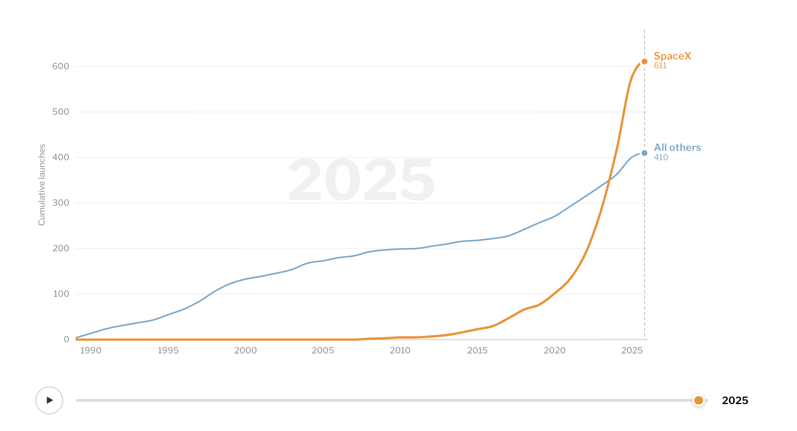

<details>
  <summary>EDA Sketch</summary>

  
  
</details>

<div class="grid grid-cols-3">
  <div class="card red">Apple</div>
  <div class="card yellow">Banana</div>
  <div class="card red">Cherry</div>
  <div class="card yellow grid-colspan-3">Durian</div>
  <div class="card blue">Elderberry</div>
  <div class="card blue">Fig</div>
  <div class="card green">Grape</div>
</div>

```js
import {FileAttachment} from "observablehq:stdlib";

const hello = await FileAttachment("hello.txt").text();
const words = hello.split(" ");
const str = view(Inputs.range([0, words.length], {step: 1}));
```

```js
const gapminder = await FileAttachment("data/gapminder.zip").zip();
const continents = await gapminder.file("gapminder/continents.csv").csv();
const list = Inputs.table(continents);
const listtwo = continents.map(d => d.Entity).join(", ");
```

```js
const life2010 = await FileAttachment("data/life2010.csv").csv();
const listlife = Inputs.table(life2010);

const gdp2010 = await FileAttachment("data/gdp2010.csv").csv();
const listgdp = Inputs.table(gdp2010);
```

```js
const color = view(Inputs.radio(
  ["blue", "red", "green", "yellow"],
  {label: "Dot color", value: "blue"}
))

const gdpByEntity = new Map(gdp2010.map(d => [d.Entity, +d["GDP per capita"]]));

const data = life2010.map(d => ({
    Entity: d.Entity,
    GDP: gdpByEntity.get(d.Entity),
    life: +d["Life expectancy"]
})).filter(d => d.GDP != null);

function scatterPlot(data, color, {width} = {}) {
  return Plot.plot({
    width,
    height: 300,
    marginLeft: 50,

    x: {
      type: "log",
      domain: d3.extent(data, d => d.GDP),
      label: "GDP per capita"
    },

    y: {
      type: "linear",
      domain: d3.extent(data, d => d.life),
      label: "Life expectancy"
    },

    marks: [
      Plot.dot(data, {
        x: d => d.GDP,
        y: d => d.life,
        fill: color,
        r: 3
      })
    ]
  });
}
```

<div class="grid grid-cols-1">
  <div class="card">
    ${resize((width) => scatterPlot(data, color, {width}))}
  </div>
</div>

Printing ${str} words: ${words.slice(0, str).join(" ")}

Filenames: ${gapminder.filenames}
${list}
${listtwo}
${listlife}
${listgdp}